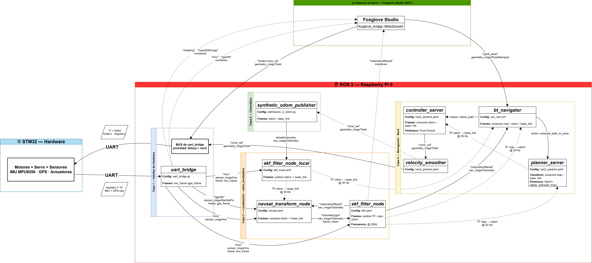
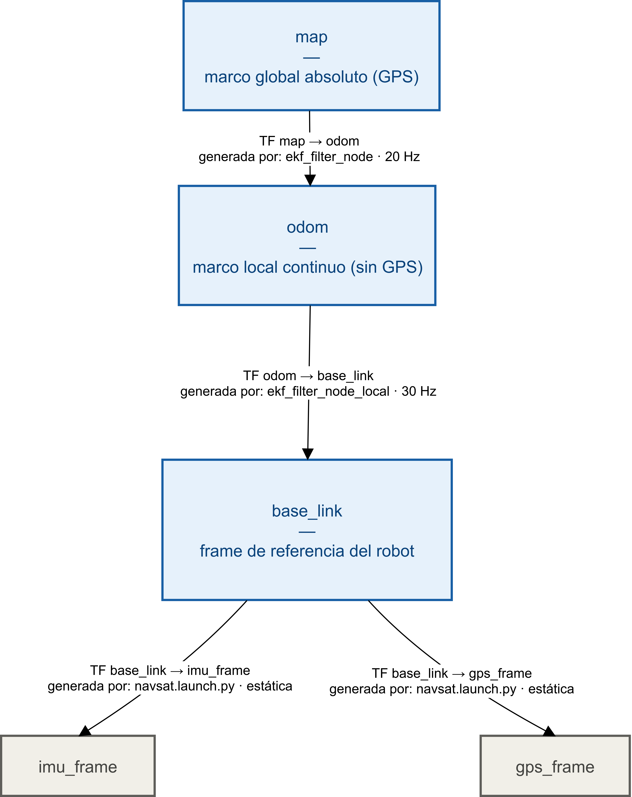
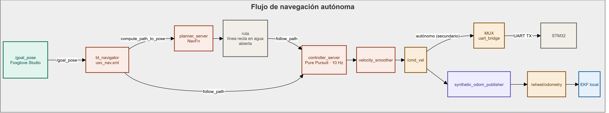
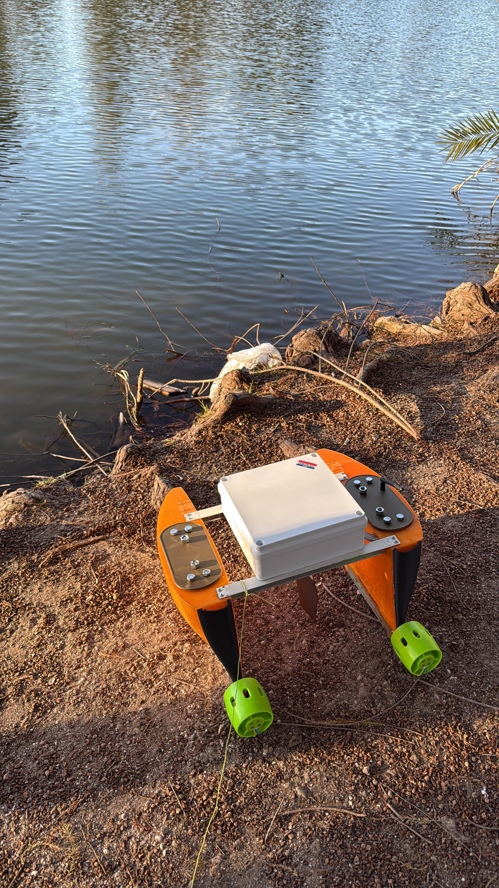
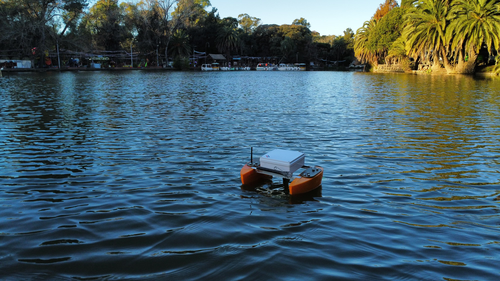

# USV Autónomo — ROS 2 (Jazzy Jalisco)

> Sistema de navegación autónoma para un vehículo de superficie no tripulado (USV) tipo catamarán, desarrollado sobre ROS 2 Jazzy Jalisco. Integra la fusión de sensores (principalmente IMU y GPS), odometría sintética y la pila de navegación Nav2. La operación remota y el monitoreo en tiempo real se realizan desde una base terrestre mediante Foxglove Studio sobre una conexión WiFi.

---

### Software y Frameworks


### Hardware y Electrónica

-03234B?style=for-the-badge&logo=stmicroelectronics&logoColor=white)


### Herramientas de Control y Monitoreo


## Tabla de Contenidos

1. [Descripción General](#descripción-general)
2. [Arquitectura del Sistema](#arquitectura-del-sistema)
3. [Estructura del Workspace](#estructura-del-workspace)
4. [Paquete robot\_1 — Interfaz de Hardware](#paquete-robot_1--interfaz-de-hardware)
5. [Paquete robot\_config — Localización y Navegación](#paquete-robot_config--localización-y-navegación)
6. [Instalación y Dependencias](#instalación-y-dependencias)
7. [Uso](#uso)
8. [Decisiones de Diseño y Limitaciones](#decisiones-de-diseño-y-limitaciones)
9. [Demostración](#demostración--ensayo-en-lago-del-bosque-la-plata)

---

## Descripción General

### El vehículo

El USV desarrollado es un catamarán de construcción propia compuesto por dos cascos rígidos ahuecados diseñados e impresos en 3D, unidos entre sí por dos travesaños de aluminio. Cada casco aloja la electrónica involucradaaprovechando la propiedad de ser ahuecado, y está sellado de forma estanca mediante tapas superiores con o-rings que garantizan la impermeabilidad. Además, la salida de cables y conexiones de los mismos se encuentran sellados fijamente mediante silicona. La propulsión se logra mediante dos motores unidireccionales, uno ubicado en la popa de cada casco. La dirección se controla mediante el control de dichos motores, sumado a un único timón gobernado por un servo-motor, cuyo eje emerge de la caja estanca central.

Sobre los travesaños de aluminio se atornilla una caja estanca independiente que aloja la computadora a bordo (Raspberry Pi 5). Esta caja se comunica mediante conexiones LAN con la electrónica presente en los cascos, que principalmente consta de una PCB que integra una placa de desarrollo STM32F103 (BluePill) encargada de controlar y recepcionar los datos de los actuadores y sensores presentes. En este caso la STM32 actúa como controlador de bajo nivel gestionando los sensores (IMU MPU9250, GPS NEO-6M, sensor de corriente ACS712) montados en PCB, así como los actuadores (los motores mediante sus respectivos ESCs y el servo de timón, todo con control mediante generación PWM).

### Objetivo del sistema

El sistema permite al USV operar principalmente en dos modos:

- **Manual (Teleop):** Un operador envía comandos de velocidad en tiempo real desde la estación en tierra a través de WiFi, con prioridad absoluta sobre el sistema autónomo. El barco responde inmediatamente y Nav2 queda inhibido durante el tiempo que dure el control manual.
- **Autónomo:** El operador define waypoints geográficos (latitud/longitud) desde Foxglove Studio. Nav2 planifica y ejecuta la trayectoria utilizando un Filtro de Kalman Extendido (EKF) que fusiona datos de la IMU, el GPS y una odometría sintética para estimar la posición del barco en todo momento. 
> Por **odometría sintética** se refiere a que no proviene de medir un movimiento físico real, sino de un cálculo matemático basado en intenciones.

### Interfaz de usuario y monitoreo

La interacción con el USV desde tierra se realiza a través de **Foxglove Studio**, conectado al sistema ROS 2 a bordo mediante **`foxglove_bridge`** (protocolo WebSocket sobre WiFi). Esta herramienta permite:

- **Visualizar en tiempo real** los tópicos del sistema: posición GPS, orientación IMU, odometría, velocidades comandadas, estado de Nav2 y transformaciones TF.
- **Enviar waypoints** al sistema de navegación autónoma mediante el plugin de mapa integrado, haciendo clic directamente sobre el mapa para definir los puntos de destino.
- **Teleoperar el barco** publicando comandos de velocidad en `/turtle1/cmd_vel` desde paneles de control personalizados.
- **Monitorear el estado** de los filtros EKF, el árbol de comportamiento de Nav2 y los datos crudos de los sensores.

La conexión WiFi es el único canal de comunicación entre la estación en tierra y el USV durante la operación. Toda la inteligencia de navegación reside y se ejecuta a bordo en la Raspberry Pi 5.

### Stack tecnológico

| Componente | Tecnología |
|---|---|
| Sistema operativo | Linux (Ubuntu Noble 24.04) |
| Framework robótico | ROS 2 Jazzy Jalisco|
| Computadora a bordo | Raspberry Pi 5 |
| Microcontrolador | STM32F103C8T6 |
| Sensores | GPS (Neo6M-NMEA), IMU MPU9250 (acelerómetro + giroscopio + magnetómetro), Sensor de corriente ACS712 |
| Actuadores | 2× motor sumergible unidireccional + 1× servo de timón |
| Comunicación RPi 5 ↔ STM32 | UART sobre cable LAN |
| Comunicación tierra ↔ USV | WiFi (IEEE 802.11) |
| Interfaz de usuario | Foxglove Studio + `foxglove_bridge` (WebSocket) |
| Localización | `robot_localization` (doble EKF) |
| Transformación GPS | `navsat_transform_node` (`robot_localization`) |
| Navegación autónoma | Nav2 (Pure Pursuit Controller + NavFn Planner) |
| Build system | `colcon` |

---

## Arquitectura del Sistema
   
### Tres capas del sistema

El sistema se organiza en tres capas que interactúan entre sí:

**Capa de Estación de control:** Una PC con Foxglove Studio conectada por WiFi al USV. Desde aquí el operador visualiza el estado del sistema, teleopera el barco y define waypoints geográficos en el mapa.

**Capa de ROS 2 (Raspberry Pi 5 a bordo):** Es el núcleo del sistema. Recibe las tramas UART del STM32 y las convierte en mensajes estándar de ROS 2. Fusiona datos de sensores con filtros EKF para estimar la posición. Ejecuta Nav2 para planificar y seguir rutas. Implementa un multiplexor que arbitra entre comandos manuales y autónomos, priorizando siempre al operador humano.

**Capa de hardware (STM32):** Adquiere datos crudos de la IMU y el GPS principalmente, los empaqueta y los envía por UART. Recibe comandos de velocidad y los traduce al control físico de motores y servo.

### Diagrama de comunicación global

   

### Mapa de tópicos principales

| Tópico | Tipo | Productor | Consumidor | Descripción |
|---|---|---|---|---|
| `/imu` | `sensor_msgs/Imu` | `uart_bridge` | `ekf_local`, `ekf_global`, `navsat_transform` | Aceleración, velocidad angular y orientación (IMU calibrada, frame: `imu_frame`) |
| `/mpu9250/mag` | `sensor_msgs/MagneticField` | `uart_bridge` | Foxglove *(monitoreo)* | Campo magnético crudo del MPU9250 (frame: `imu_frame`) |
| `/gps/fix` | `sensor_msgs/NavSatFix` | `uart_bridge` | `navsat_transform`, Foxglove *(monitoreo)* | Posición GPS (lat/lon/alt) con estado de fix (frame: `gps_frame`) |
| `/heading` | `std_msgs/Float32` | `uart_bridge` | Foxglove *(monitoreo)* | Rumbo magnético calculado desde el magnetómetro |
| `/wheel/odometry` | `nav_msgs/Odometry` | `synthetic_odom_publisher` | `ekf_local` | Odometría sintética con modelo de inercia (frame: `odom → base_link`) |
| `/odometry/gps` | `nav_msgs/Odometry` | `navsat_transform` | `ekf_global` | Posición GPS convertida a coordenadas cartesianas UTM (frame: `odom`) |
| `/odometry/filtered` | `nav_msgs/Odometry` | `ekf_global` | `bt_navigator`, `navsat_transform` ⚠️, Foxglove *(monitoreo)* | Estimación de posición fusionada en el mapa global. El ciclo hacia `navsat_transform` es intencional (doble EKF) |
| `/cmd_vel` | `geometry_msgs/Twist` | `controller_server` → `velocity_smoother` | MUX `uart_bridge` (secundario), `synthetic_odom_publisher` | Comandos de velocidad autónomos suavizados por `velocity_smoother` antes de llegar al MUX |
| `/turtle1/cmd_vel` | `geometry_msgs/Twist` | Foxglove Studio (WiFi) | MUX `uart_bridge` (prioritario) | Comandos de teleoperación manual — tienen prioridad absoluta sobre Nav2 |
| `/goal_pose` | `geometry_msgs/PoseStamped` | Foxglove Studio (WiFi) | `bt_navigator` | Waypoint destino definido desde el plugin de mapa de Foxglove |

### Transformaciones TF publicadas



| Transformación | Publicador | Frecuencia | Descripción |
|---|---|---|---|
| `map → odom` | `ekf_filter_node` | 20 Hz | Ancla la posición del robot al mapa global (GPS) |
| `odom → base_link` | `ekf_filter_node_local` | 30 Hz | Estimación continua del movimiento relativo del robot |
| `base_link → imu_frame` | `navsat.launch.py` (estática) | — | Offset físico de la IMU respecto al centro del barco |
| `base_link → gps_frame` | `navsat.launch.py` (estática) | — | Offset físico del GPS respecto al centro del barco |

### Configuración de la transformación GPS (`navsat.yaml`)

El nodo `navsat_transform_node` convierte las coordenadas geográficas del GPS (lat/lon WGS84) a coordenadas cartesianas planas (UTM) que son las que logra utilizar ROS 2, publicando el resultado en `/odometry/gps` para que el EKF global pueda consumirlo. Además, se suscribe a `/odometry/filtered` (la salida del EKF global) para conocer la posición actual del robot y alinear correctamente cada nueva lectura GPS — esto crea un "loop" intencional entre `navsat_transform_node` y `ekf_global` que es la base de la arquitectura de doble EKF. 
Dentro de su archivo de configuración, los parámetros más relevantes son:

- **`use_odometry_yaw: true`** — El yaw de referencia para la transformación se toma de la odometría (EKF local) y no directamente de la IMU. Esto se mantuvo porque principalmente mejora la estabilidad, posible mejora integrar el yaw a partir de procesar los datos de la IMU.
- **`magnetic_declination_radians: -0.18006`** — Declinación magnética configurada para la zona de operación (en este caso La Plata, Argentina). Compensa la diferencia entre el norte magnético y el norte geográfico.
- **`zero_altitude: true`** — Fuerza la altitud a 0, por que se trata de operación en superficie.
- **`broadcast_cartesian_transform: true`** — Publica la transformación TF cartesiana necesaria para que Nav2 ubique al robot en el mapa.
- **`wait_for_datum: false`** — El sistema no espera un datum fijo; se inicializa con la primera lectura GPS válida.
- **`frequency: 30 Hz`**, **`delay: 1.0 s`** — Opera a 30 Hz con una ventana de sincronización de 1 segundo para alinear temporalmente las lecturas de IMU, GPS y odometría.

---

## Estructura del Workspace

```
ros2_ws/
├── docs/
│   └── imgs/                         ← Imágenes y diagramas del proyecto
│       ├── USV con Elementos.drawio.png
│       ├── USV_DiagrmaNodosTopicos.drawio.png
│       ├── usv_lago_1.jpeg
│       ├── usv_lago_2.jpeg
│       ├── arbol_de_tf.drawio.png
│       ├── Flujo_MUX_uart_bridge.drawio.png
│       └── Flujo_Nav_auto.drawio.png
└── src/
    ├── robot_1/                         ← Paquete de interfaz de hardware
    │   └── robot_1/
    │       ├── uart_bridge.py           ← Nodo principal de comunicación serie
    │       ├── estimacion_2_odom.py     ← Odometría sintética con inercia
    │       ├── cmd_vel_listener.py      ← Utilidad de debug (no activo en producción)
    │       ├── nav2_manager.py          ← Cliente de waypoints (en desarrollo)
    │       ├── estimacion_odom.py       ← Versión anterior de odometría (archivada)
    │       └── VIEJOuart_b_prom.py      ← Versión anterior de uart_bridge (archivada)
    └── robot_config/                    ← Paquete de localización y navegación
        ├── config/
        │   ├── ekf_local.yaml           ← Parámetros EKF local (odom→base_link)
        │   ├── ekf.yaml                 ← Parámetros EKF global (map→odom)
        │   ├── navsat.yaml              ← Parámetros transformación GPS→UTM
        │   ├── nav2_params.yaml         ← Parámetros completos de Nav2
        │   └── usv_nav.xml              ← Árbol de comportamiento Nav2
        └── launch/            
            ├── node_localization.launch.py  ← Orquestador de localización
            ├── navsat.launch.py             ← TFs estáticos + navsat_transform
            ├── ekf_local.launch.py          ← EKF local
            ├── ekf.launch.py                ← EKF global
            ├── navigation.launch.py         ← Stack completo de Nav2
            └── viejo_nav2.launch.py         ← Versión anterior de Nav2 (archivada)
```

---

### `robot_1` — Archivos funcionales

#### `uart_bridge.py`
Es el nodo más crítico del sistema. Cumple tres roles simultáneos: leer y parsear los datos crudos del hardware, publicarlos como mensajes estándar de ROS 2, y arbitrar qué comandos de velocidad se envían físicamente a los motores.

**Comunicación serie:** Lee continuamente el puerto `/dev/ttyAMA0` a 30 Hz. Cada trama entrante tiene 55 bytes y comienza con un byte de cabecera que indica su tipo: `0x49` ('I') para datos de IMU y `0x47` ('G') para datos de GPS. El struct de IMU se desempaqueta como `<9i4f` (9 enteros + 4 floats), obteniendo acelerómetro, giroscopio, magnetómetro y cuaternión. A partir del struct de GPS extrae latitud, longitud, altitud, número de satélites (in view) y estado del fix.

**Calibración de IMU:** Durante los primeros 20 segundos de operación el nodo acumula lecturas de acelerómetro y giroscopio en un buffer, calcula el promedio de cada eje y lo guarda como offset. A partir de ese momento todas las publicaciones aplican estos offsets para eliminar el sesgo (bias) del sensor. Durante la calibración no se publican datos de IMU.

**Orientación:** El cuaternión que provee el MPU9250 se usa para roll y pitch, pero el yaw se reemplaza completamente por el heading calculado desde el magnetómetro (con offsets hardcodeados: `mx-120.2`, `my-118.3`, `mz+67.1`). Esto se hace porque el yaw del MPU9250 acumula deriva, mientras que el magnetómetro provee una referencia absoluta al norte magnético.

**MUX de control:** Implementa un sistema de prioridad entre dos fuentes de comandos. El canal manual de teleoperación (`/turtle1/cmd_vel`) tiene prioridad absoluta: cada vez que llega un mensaje manual se actualiza un timestamp. El canal autónomo (`/cmd_vel` de Nav2) solo se procesa si han pasado más de `teleop_timeout` segundos (1.0 s por defecto) desde el último comando manual. Incluye una lógica especial para giros estáticos: si se detecta `angular.z ≠ 0` con `linear.x ≈ 0`, fuerza `linear.x = 1.0` para asegurar flujo de agua sobre el timón (necesario para que el timón tenga efecto). Los comandos se empaquetan como `'V' + pack('<BB', linear_x, angular_z)` donde `linear_x ∈ [0,255]` y `angular_z ∈ [0,255]` centrado en 128.

**Watchdog serial:** Cada 2 segundos envía la trama `b"W\1\1"` al STM32 como señal de vida. Si el STM32 deja de recibir esta trama, puede implementar una rutina de seguridad (parada de motores) del lado del firmware.

---

#### `estimacion_2_odom.py`
Resuelve el problema de la ausencia de encoders en los motores del barco. Sin encoders no hay forma de medir directamente cuánto se desplazó el barco, por lo que este nodo genera una odometría "sintética" a partir de los comandos de velocidad y un modelo simplificado de inercia acuática.

**Modelo de inercia:** En lugar de aplicar los comandos de velocidad instantáneamente, aplica un filtro de primer orden: `velocidad_actual += (velocidad_deseada - velocidad_actual) × 0.1`. Este factor (0.1) simula la inercia del barco en el agua, suavizando las transiciones de velocidad. Cuando la velocidad actual cae por debajo de 0.01 m/s se fuerza a cero para evitar deriva.

**Integración de posición:** En cada ciclo de 30 Hz integra la velocidad actual en el tiempo para actualizar la posición teórica `(x, y, θ)` del barco. Esta posición no representa la posición real en el mundo (para eso está el GPS), sino el desplazamiento relativo desde el inicio, que el EKF local usa para estimar la transformación `odom → base_link`.

**Watchdog:** Si no recibe ningún mensaje en `/cmd_vel` durante más de 1 segundo, fuerza los targets de velocidad a cero, lo que hace que el barco frene gradualmente por el modelo de inercia. Esto evita que el barco continúe "navegando virtualmente" si Nav2 deja de publicar comandos.

**Covarianza dinámica:** Cuando el barco está detenido (`target_vx ≈ 0` y `target_wz ≈ 0`) la covarianza del twist se establece en `1e-9` (confianza casi absoluta en que la velocidad es cero), lo que actúa como un "ancla" para el EKF y evita que el filtro derive durante las paradas. Cuando el barco está en movimiento la covarianza sube a `0.5` (baja confianza), indicando al EKF que priorice otros sensores. La covarianza de pose se mantiene fija en `0.1` ya que la posición absoluta no se usa para localizar al robot.

---

#### `cmd_vel_listener.py`
Nodo de utilidad para depuración. Se suscribe a `/turtle1/cmd_vel` y loguea por consola los valores de `linear.x` y `angular.z` cada vez que llega un mensaje. No publica ningún tópico ni tiene ningún rol en el sistema productivo. Es útil durante el desarrollo para verificar que los comandos de teleoperación llegan correctamente antes de conectar el hardware.

---

#### `nav2_manager.py`
Cliente de acción para el envío programático de waypoints a Nav2. Implementa un `ActionClient` del tipo `FollowWaypoints` que construye una lista de `PoseStamped` y la envía al action server de Nav2. Incluye callbacks de feedback (waypoint actual), respuesta de goal (aceptado/rechazado) y resultado final.

**Estado actual:** El nodo está en desarrollo. El `main()` contiene tres waypoints hardcodeados en formato `(lat, lon)` correspondientes a una zona de prueba, pero la conversión de coordenadas GPS a coordenadas del marco `map` aún no está implementada. En el sistema activo los waypoints se envían desde Foxglove Studio vía `/goal_pose`. Este nodo está pensado para misiones autónomas preprogramadas sin intervención del operador.

---

### `robot_config` — Archivos de configuración

#### `ekf_local.yaml`
Configura el EKF local (`ekf_filter_node_local`) que opera a 30 Hz con `world_frame: odom`. Su función es proporcionar una estimación continua y suave del movimiento relativo del barco, publicando la transformación `odom → base_link`.

Fusiona dos fuentes de datos: la odometría sintética de `/wheel/odometry` (se usan las velocidades lineales vx, vy, vz y la velocidad angular wz) y la IMU de `/imu` (se usan orientación en roll/pitch/yaw, velocidades angulares y aceleraciones lineales). No consume GPS, por lo que su estimación deriva con el tiempo pero es muy estable en el corto plazo. La `process_noise_covariance` está configurada con valores bajos en posición (`1e-3`) y valores moderados en velocidades (`0.5`), reflejando que el modelo cinemático del barco no es perfectamente conocido.

---

#### `ekf.yaml`
Configura el EKF global (`ekf_filter_node`) que opera a 20 Hz con `world_frame: map`. Su función es anclar la posición del barco al mundo real usando el GPS, publicando la transformación `map → odom` y el tópico `/odometry/filtered`.

Fusiona la IMU de `/imu` (orientación y velocidades angulares) y la posición GPS cartesiana de `/odometry/gps` (x, y, z absoluto proveniente de `navsat_transform_node`). La odometría de `/wheel/odometry` está comentada en esta configuración, dejando que el GPS sea la fuente primaria de posición absoluta. La `process_noise_covariance` es más permisiva en posición (`1.0`) que en el EKF local, aceptando que la posición GPS tiene mayor incertidumbre intrínseca.

---

#### `navsat.yaml`
Configura el nodo `navsat_transform_node`, cuya función principal es convertir las coordenadas geográficas del GPS (latitud/longitud WGS84) a coordenadas cartesianas planas (UTM) utilizables por ROS 2.

Los parámetros más relevantes son: `magnetic_declination_radians: -0.18006` (declinación magnética para la zona de La Plata, Argentina, obtenida de NOAA), `use_odometry_yaw: true` (el yaw para alinear la transformación GPS→UTM se toma de la odometría vía TF `odom→base_link`, no de la IMU directamente), `zero_altitude: true` (fuerza altitud a 0 para operación en superficie), `broadcast_cartesian_transform: true` (publica la TF cartesiana necesaria para Nav2) y `wait_for_datum: false` (se inicializa con la primera lectura GPS válida, sin esperar un datum fijo). Opera a 30 Hz con una ventana de sincronización de 1 segundo para alinear temporalmente las lecturas de IMU, GPS y odometría.

---

#### `nav2_params.yaml`
Archivo central de configuración de toda la pila Nav2, adaptado específicamente a las restricciones cinemáticas y dinámicas de una embarcación de superficie.

**Controller (Pure Pursuit):** Se eligió `RegulatedPurePursuitController` en lugar del controlador DWB porque Pure Pursuit es más adecuado para vehículos no holonómicos con alta inercia. `use_rotate_to_heading: false` desactiva la rotación en el lugar (imposible para un barco con timón). `allow_reversing: false` desactiva la marcha atrás (los motores son unidireccionales). `desired_linear_vel: 1.0 m/s` con `lookahead_dist: 1.5 m`.

**Goal checker:** `xy_goal_tolerance: 4.0 m` y `yaw_goal_tolerance: 0.5 rad`. La tolerancia de 4 metros reconoce el error natural del GPS y la inercia del barco al detenerse.

**Costmaps:** Local (40×40 m) y global (100×100 m, rolling window) configurados sin capa de obstáculos estáticos, solo con `inflation_layer`. Esto es intencional: el barco opera en cuerpos de agua abiertos sin obstáculos mapeados. `resolution: 0.5 m`.

**Planner (NavFn):** `allow_unknown: true` permite planificar sobre celdas desconocidas del costmap, esencial para navegación en mar abierto donde no hay mapa previo. `tolerance: 4.0 m` es consistente con la tolerancia del goal checker.

---

#### `usv_nav.xml`
Define el árbol de comportamiento (Behavior Tree) que Nav2 ejecuta para navegar hacia un waypoint. Está simplificado respecto al árbol por defecto de Nav2 para adaptarse a la operación en entornos acuáticos abiertos donde los comportamientos de recuperación complejos (como retroceder o girar en el lugar) no son aplicables.

El árbol intenta computar un camino hacia el goal y seguirlo. Si la navegación falla, ejecuta una única acción de recuperación: esperar 5 segundos (`<Wait wait_duration="5.0"/>`) antes de reintentar. Esta estrategia de recuperación minimalista es deliberada: en un barco, las maniobras de recuperación agresivas (spin, backup) pueden ser contraproducentes o imposibles dadas las restricciones cinemáticas.

---

### `robot_config` — Launch files

#### `launch_general.launch.py`
Es el entry point del sistema completo. Orquesta el arranque de todos los subsistemas en el orden correcto usando un `TimerAction` de 5 segundos entre la localización y Nav2. Este retardo es fundamental: permite que los filtros EKF se inicialicen y estabilicen con las primeras lecturas de IMU y GPS antes de que Nav2 intente leer las transformaciones TF. Si Nav2 arrancara inmediatamente, fallaría al no encontrar las TFs `map→odom→base_link` disponibles.

Secuencia de arranque:
1. `navsat.launch.py` — TFs estáticos + navsat_transform_node
2. `node_localization.launch.py` — EKF local + EKF global
3. *(espera 5 segundos)*
4. `navigation.launch.py` — Stack completo de Nav2

---

#### `node_localization.launch.py`
Orquestador de la capa de localización. Lanza en orden: `navsat.launch.py`, `ekf_local.launch.py` y `ekf.launch.py`. Centraliza el arranque de los tres nodos de localización para que puedan ser iniciados como una unidad tanto desde `launch_general.launch.py` como de forma independiente durante el desarrollo o depuración.

---

#### `navsat.launch.py`
Lanza el nodo `navsat_transform_node` con la configuración de `navsat.yaml` y define las **transformaciones TF estáticas** que describen la posición física de los sensores respecto al centro del barco (`base_link`): la IMU en `imu_frame` y el GPS en `gps_frame`. Estas TFs estáticas son fundamentales para que el EKF pueda compensar el offset físico entre los sensores y el punto de referencia del robot.

---

#### `navigation.launch.py`
Lanza todos los nodos del stack Nav2: `controller_server`, `smoother_server`, `planner_server`, `behavior_server`, `bt_navigator`, `waypoint_follower`, `velocity_smoother` y `lifecycle_manager`. Resuelve en Python la ruta absoluta del archivo XML del árbol de comportamiento (`usv_nav.xml`) y la inyecta directamente como parámetro del `bt_navigator`, sobreescribiendo el placeholder `{path_to_pkg}` del YAML. Todos los nodos se gestionan bajo el ciclo de vida de ROS 2 a través del `lifecycle_manager`.

---

## Paquete `robot_1` — Interfaz de Hardware

El paquete `robot_1` es la capa más cercana al hardware del sistema. Su responsabilidad es doble: hacia abajo, habla con el STM32 por UART para leer sensores y comandar actuadores; hacia arriba, publica datos en tópicos estándar de ROS 2 y consume comandos de velocidad del resto del sistema. Todo esto ocurre de forma simultánea y continua durante la operación.

### Nodos activos

El paquete pone en juego dos nodos en producción:

**`uart_bridge`** (`uart_bridge.py`) es el nodo principal. Gestiona la comunicación serie, publica los sensores y contiene el MUX de control. Es el único nodo del sistema que escribe físicamente hacia el hardware.

**`synthetic_odom_publisher`** (`estimacion_2_odom.py`) corre en paralelo. Escucha el mismo tópico `/cmd_vel` que el MUX y construye una estimación de movimiento del barco basada en inercia simulada, publicándola como odometría para el EKF local.

### Interacción entre nodos

Aunque ambos nodos son independientes entre sí (no se llaman directamente), están acoplados a través del tópico `/cmd_vel`:



Esto significa que cuando Nav2 ordena una velocidad, ambos nodos la reciben simultáneamente: `uart_bridge` la ejecuta físicamente en los motores, y `synthetic_odom_publisher` la usa para estimar cuánto se movió el barco. El EKF local toma esa estimación y la fusiona con la IMU para mantener la transformación `odom → base_link` actualizada.

El canal de teleoperación (`/turtle1/cmd_vel`) en cambio **solo llega a `uart_bridge`**. El `synthetic_odom_publisher` no lo escucha, por lo que durante la teleoperación la odometría sintética no refleja el movimiento real — solo refleja lo que Nav2 habría ordenado. Esto es una limitación conocida del diseño actual.

### Flujo de ejecución en tiempo real

**Fase 1 — Arranque y calibración (0 a 20 segundos):**

Al iniciar, `uart_bridge` abre el puerto `/dev/ttyAMA0` y comienza a leer tramas. Durante los primeros 20 segundos acumula lecturas de la IMU en un buffer para calcular los offsets de calibración. Durante este período **no publica `/imu`**, lo que significa que los filtros EKF no tienen datos de orientación y no pueden inicializarse correctamente. 

**Fase 2 — Operación normal:**

Una vez calibrada la IMU, `uart_bridge` comienza a publicar `/imu`, `/gps/fix`, `/heading` y `/mpu9250/mag` a 30 Hz. El `synthetic_odom_publisher` ya está publicando `/wheel/odometry` desde el inicio (con velocidad cero). Los filtros EKF pueden ahora inicializarse y comenzar a publicar las transformaciones TF. Nav2 arranca 5 segundos después (ver `launch_general.launch.py`) para asegurarse de que las TFs estén disponibles.

**Fase 3 — Recepción de comandos:**

El sistema queda en escucha de dos canales:

- Si llega un mensaje en `/turtle1/cmd_vel` → el MUX lo procesa inmediatamente, actualiza el timestamp de teleop y envía la velocidad al STM32. Nav2 queda bloqueado durante `teleop_timeout` segundos (1.0 s por defecto).
- Si llega un mensaje en `/cmd_vel` y han pasado más de `teleop_timeout` segundos desde el último teleop → el MUX lo procesa y envía la velocidad al STM32.

En ambos casos, si el comando detecta `angular.z ≠ 0` con `linear.x ≈ 0`, el MUX fuerza `linear.x = 1.0` antes de enviar, para asegurar flujo de agua sobre el timón.

**Fase 4 — Watchdogs:**

Dos watchdogs operan en paralelo:

`uart_bridge` envía la trama `b"W\1\1"` al STM32 cada 2 segundos como señal de vida. Si el STM32 deja de recibirla, puede implementar una parada de emergencia del lado del firmware.

`synthetic_odom_publisher` monitorea cuánto tiempo pasó sin recibir `/cmd_vel`. Si supera 1 segundo, fuerza las velocidades objetivo a cero y el barco frena gradualmente por el modelo de inercia.

### Parámetros configurables

Todos los parámetros relevantes del paquete están centralizados en los nodos. Los más importantes para tunear el comportamiento del sistema son:

#### `uart_bridge.py`

| Parámetro | Valor por defecto | Descripción |
|---|---|---|
| `port` | `/dev/ttyAMA0` | Puerto serie del STM32. Cambiar si se usa otro puerto UART. |
| `baud` | `115200` | Velocidad de comunicación. Debe coincidir con la configuración del firmware STM32. |
| `frame_id` | `imu_frame` | Frame de referencia para los mensajes IMU y magnetómetro. |
| `teleop_timeout` | `1.0` s | Tiempo de inactividad del teleop antes de ceder el control a Nav2. Aumentar si el operador necesita más tiempo de reacción. |
| `calibration_duration` | `20.0` s | Duración de la calibración de IMU al arranque. Reducir solo en entornos controlados donde el sesgo sea mínimo. |

Los offsets del magnetómetro (`mx-120.2`, `my-118.3`, `mz+67.1`) están hardcodeados en `publish_imu()`. Si se cambia la IMU o su posición física, estos valores deben recalibrarse manualmente.

#### `estimacion_2_odom.py`

| Parámetro | Valor por defecto | Descripción |
|---|---|---|
| `inertia_factor` | `0.1` | Factor del filtro de inercia (0 a 1). Valores más bajos = más inercia simulada, respuesta más lenta. Valores más altos = respuesta más rápida, menos suavizado. |
| `cmd_timeout` | `1.0` s | Tiempo sin recibir `/cmd_vel` antes de asumir detención. |
| Snap-to-zero threshold | `0.01` m/s | Velocidad mínima por debajo de la cual se fuerza a cero. Evita deriva infinitesimal. |
| Covarianza detenido | `1e-9` | Confianza en velocidad = 0 cuando el barco está parado. Actúa como ancla para el EKF. |
| Covarianza movimiento | `0.5` | Confianza en la odometría durante el movimiento. Valor alto indica al EKF que priorice otros sensores. |

---

## Paquete `robot_config` — Localización y Navegación

El paquete `robot_config` contiene toda la configuración de la navegación autónoma del USV: los filtros de fusión de sensores (EKF), la transformación GPS→UTM, la pila de navegación Nav2 y los archivos de lanzamiento del arranque del sistema completo. A diferencia de `robot_1`, este paquete no contiene código Python propio sino la configuración de nodos externos adaptados al objetivo del proyecto.

---

### Flujo de localización en tiempo real

La localización es el proceso por el cual el sistema construye continuamente dónde está el barco y hacia dónde mira. Combina tres fuentes de información — la odometría sintética, la IMU y el GPS — usando la arquitectura de doble EKF.

**Paso 1 — Datos crudos disponibles:**

Desde el momento en que `uart_bridge` termina la calibración, el sistema cuenta con tres flujos de datos continuos: `/imu` (orientación, velocidades angulares y aceleraciones a 30 Hz), `/gps/fix` (posición lat/lon a la frecuencia del receptor GPS) y `/wheel/odometry` (velocidad estimada por inercia a 30 Hz).

**Paso 2 — Transformación GPS→UTM (`navsat_transform_node`):**

El GPS entrega coordenadas esféricas (latitud/longitud) que ROS 2 no puede usar directamente. `navsat_transform_node` las proyecta al plano cartesiano UTM, produciendo una posición en metros `(x, y)` relativa al punto de inicio. Para hacer esta proyección correctamente necesita saber hacia dónde mira el barco en ese momento, por lo que consume la TF `odom → base_link` (producida por el EKF local). El resultado se publica en `/odometry/gps`.

**Paso 3 — EKF local (`ekf_filter_node_local`):**

Fusiona `/wheel/odometry` e `/imu` a 30 Hz. No usa GPS, por lo que su estimación deriva lentamente con el tiempo, pero es muy estable en el corto plazo y no sufre los saltos que el GPS puede introducir. Publica la TF `odom → base_link`, que representa el movimiento relativo del barco desde que arrancó.

**Paso 4 — EKF global (`ekf_filter_node`):**

Fusiona `/odometry/gps` e `/imu` a 20 Hz. Su función es anclar la posición del barco al mundo real. Publica `/odometry/filtered` (la pose absoluta del barco en el mapa) y la TF `map → odom`. El ciclo con `navsat_transform_node` es intencional: a medida que el EKF global mejora su estimación de posición, se la devuelve a `navsat_transform_node` para que las siguientes transformaciones GPS sean más precisas.

El resultado final es el árbol TF completo:


Con este árbol disponible, cualquier nodo del sistema puede conocer la posición y orientación del barco en el mundo en cualquier momento consultando las TFs.

---

### Flujo de navegación autónoma

Una vez que la localización está estable y Nav2 está activo, el flujo de una misión autónoma completa es el siguiente:

**1. Recepción del waypoint:**
El operador hace clic en el mapa de Foxglove Studio. Foxglove publica un mensaje `geometry_msgs/PoseStamped` en `/goal_pose` con las coordenadas del punto destino en el marco `map`. `bt_navigator` lo recibe y comienza a ejecutar el árbol de comportamiento definido en `usv_nav.xml`.

**2. Planificación de la ruta:**
`bt_navigator` llama al action server `compute_path_to_pose` de `planner_server`. NavFn calcula una ruta desde la posición actual del barco hasta el waypoint usando el costmap global (100×100 m, rolling window). Como `allow_unknown: true`, puede planificar sobre celdas desconocidas — en agua abierta prácticamente todo el costmap es desconocido, por lo que la ruta resultante es casi siempre una línea recta.

**3. Seguimiento de la ruta:**
`bt_navigator` entrega la ruta al action server `follow_path` de `controller_server`. El controlador Pure Pursuit calcula en cada ciclo (10 Hz) el comando de velocidad necesario para seguir la ruta, mirando un punto de lookahead a 1.5 m por delante del barco. El comando pasa por `velocity_smoother` antes de llegar al MUX de `uart_bridge`.

**4. Verificación de llegada:**
En cada ciclo, `controller_server` verifica si el barco está dentro de la tolerancia del goal (`xy_goal_tolerance: 4.0 m`, `yaw_goal_tolerance: 0.5 rad`). Cuando se cumple, Nav2 marca la misión como completada y deja de publicar `/cmd_vel`. El watchdog de `synthetic_odom_publisher` detecta la ausencia de comandos tras 1 segundo y frena el barco gradualmente.

**5. Recuperación ante fallos:**
Si la navegación falla (por ejemplo, el barco pierde localización o el controlador no puede seguir la ruta), `bt_navigator` ejecuta la acción de recuperación definida en `usv_nav.xml`: esperar 5 segundos y reintentar. No hay maniobras de recuperación agresivas (spin, backup) ya que el barco no puede ejecutarlas.


---

### Parámetros configurables

#### Adaptar a otra zona geográfica

Si el USV opera en una zona diferente a La Plata, Argentina, el parámetro más importante a actualizar es la declinación magnética en `navsat.yaml`:

```yaml
magnetic_declination_radians: -0.18006  # ← cambiar según la zona
```

El valor correcto para cualquier coordenada geográfica se puede obtener en [ngdc.noaa.gov/geomag/calculators/magcalc.shtml](https://www.ngdc.noaa.gov/geomag/calculators/magcalc.shtml). Una declinación incorrecta introduce un error sistemático en la orientación del barco que el EKF no puede compensar.

#### Adaptar al entorno

Los parámetros más relevantes de `nav2_params.yaml` para adaptar el sistema a un barco diferente o a condiciones distintas son:

| Parámetro | Archivo | Valor actual | Cuándo cambiarlo |
|---|---|---|---|
| `desired_linear_vel` | `nav2_params.yaml` | `1.0` m/s | Aumentar para barcos más rápidos, reducir en espacios confinados |
| `lookahead_dist` | `nav2_params.yaml` | `1.5` m | Aumentar si el barco oscila al seguir la ruta. Reducir para mayor precisión en curvas |
| `max_lookahead_dist` | `nav2_params.yaml` | `2.5` m | Límite superior del lookahead dinámico |
| `xy_goal_tolerance` | `nav2_params.yaml` | `4.0` m | Reducir si el GPS es de alta precisión (RTK). Aumentar en GPS con mucho ruido |
| `inflation_radius` | `nav2_params.yaml` | `1.0` m (global) | Aumentar para mantener mayor distancia a orillas o estructuras |
| `robot_radius` | `nav2_params.yaml` | `0.35` m | Ajustar al tamaño físico real del barco |
| `frequency` | `navsat.yaml` | `30` Hz | Reducir si el receptor GPS opera a menor frecuencia |

#### Adaptar los filtros EKF

Si se cambia la IMU o los sensores, los parámetros de covarianza en `ekf_local.yaml` y `ekf.yaml` deben revisarse. Los más relevantes son:

- **`process_noise_covariance`:** valores más altos = el filtro confía menos en el modelo cinemático y más en los sensores. Aumentar si el barco tiene mucha perturbación dinámica.
- **`imu0_config`:** matriz booleana que define qué componentes de la IMU usa cada EKF. Modificar si se agrega o reemplaza la IMU por un modelo con diferentes capacidades.
- **`odom0_config`:** en `ekf_local.yaml` define qué componentes de `/wheel/odometry` se usan. Actualmente solo velocidades (no posición), lo cual es correcto para odometría sintética.

---

### Orden de arranque y dependencias

El arranque correcto del sistema depende de que cada subsistema tenga disponibles las TFs que necesita antes de inicializarse. Este orden es:

```
t=0s   navsat.launch.py       → TFs estáticas (imu_frame, gps_frame) + navsat_transform_node
t=0s   ekf_local.launch.py    → comienza a fusionar /wheel/odometry + /imu
t=0s   ekf.launch.py          → comienza a fusionar /odometry/gps + /imu
t=5s   navigation.launch.py   → Nav2 arranca con TFs ya estables
```

El `TimerAction` de 5 segundos es por dos razones. Primero, los filtros EKF necesitan algunas iteraciones para converger desde su estado inicial a una estimación confiable — si Nav2 arrancara inmediatamente, intentaría leer una TF `map → odom` que aún no existe o que tiene alta incertidumbre. Segundo, `navsat_transform_node` necesita recibir al menos una lectura de GPS válida y una TF `odom → base_link` estable antes de poder publicar `/odometry/gps`. Sin este dato, el EKF global no puede inicializarse y la TF `map → odom` nunca aparece.

---

## Instalación y Dependencias

### Requisitos del sistema

| Requisito | Versión |
|---|---|
| Sistema operativo | Ubuntu 24.04 LTS (64 bits) |
| ROS 2 | Jazzy Jalisco |
| Python | 3.12 (incluido en Ubuntu 24.04) |
| Hardware | Raspberry Pi 5 |

---

### 1. Instalar ROS 2 Jazzy

Seguir la guía oficial de instalación para Ubuntu 24.04. La variante `ros-base` es suficiente para este proyecto (no requiere herramientas de escritorio ni simulación):

```bash
# Configurar locale
sudo apt update && sudo apt install -y locales
sudo locale-gen en_US en_US.UTF-8
sudo update-locale LC_ALL=en_US.UTF-8 LANG=en_US.UTF-8

# Agregar repositorio de ROS 2
sudo apt install -y software-properties-common curl
sudo curl -sSL https://raw.githubusercontent.com/ros/rosdistro/master/ros.key \
  -o /usr/share/keyrings/ros-archive-keyring.gpg
echo "deb [arch=$(dpkg --print-architecture) signed-by=/usr/share/keyrings/ros-archive-keyring.gpg] \
  http://packages.ros.org/ros2/ubuntu $(. /etc/os-release && echo $UBUNTU_CODENAME) main" \
  | sudo tee /etc/apt/sources.list.d/ros2.list > /dev/null

# Instalar ROS 2 Jazzy base
sudo apt update
sudo apt install -y ros-jazzy-ros-base python3-colcon-common-extensions
```

---

### 2. Instalar dependencias de ROS 2

Paquetes adicionales requeridos por el sistema de localización y navegación. Se recomienda instalarlos explícitamente aunque puedan llegar como dependencias transitivas:

```bash
sudo apt install -y \
  ros-jazzy-robot-localization \
  ros-jazzy-navigation2 \
  ros-jazzy-nav2-bringup \
  ros-jazzy-foxglove-bridge \
  ros-jazzy-tf2-tools \
  ros-jazzy-tf-transformations
```

> **Nota:** `ros-jazzy-tf-transformations` provee el módulo `tf_transformations` usado en `uart_bridge.py` para convertir entre cuaterniones y ángulos de Euler. Si no está disponible en tu distribución, instalarlo vía pip (ver sección siguiente).

---

### 3. Instalar dependencias Python

```bash
pip3 install --user \
  pyserial \
  numpy \
  transforms3d
```
---

### 4. Configurar el puerto UART

La Raspberry Pi 5 requiere habilitar el puerto serie hardware (`/dev/ttyAMA0`) manualmente, ya que por defecto puede estar asignado a la consola del sistema o deshabilitado.

**Habilitar UART en `/boot/firmware/config.txt`:**

```bash
sudo nano /boot/firmware/config.txt
```

Agregar o verificar que estén presentes las siguientes líneas:

```ini
enable_uart=1
dtoverlay=uart0
```

**Deshabilitar la consola serie** para liberar el puerto:

```bash
sudo systemctl disable serial-getty@ttyAMA0.service
sudo systemctl stop serial-getty@ttyAMA0.service
```

Verificar también en `/boot/firmware/cmdline.txt` que no aparezca `console=serial0,115200`. Si está presente, eliminarlo.

**Reiniciar** para aplicar los cambios:

```bash
sudo reboot
```

**Agregar el usuario al grupo `dialout`** para acceder al puerto serie sin `sudo`:

```bash
sudo usermod -aG dialout $USER
```

Cerrar sesión y volver a iniciarla para que el cambio tenga efecto. Verificar acceso:

```bash
ls -la /dev/ttyAMA0
# Debe mostrar: crw-rw---- 1 root dialout ...
```

---

### 5. Clonar y compilar el workspace

```bash
# Clonar el repositorio
git clone https://github.com/ascatena/Autonomous-USV-ros2-jazzy.git ~/ros2_ws
cd ~/ros2_ws

# Instalar dependencias declaradas en package.xml
sudo rosdep init  # solo la primera vez
rosdep update
rosdep install --from-paths src --ignore-src -r -y

# Compilar
source /opt/ros/jazzy/setup.bash
colcon build --symlink-install

# Sourcear el workspace
source install/setup.bash
```

> **Nota:** Agregar el source automático al `.bashrc` para no tener que ejecutarlo en cada sesión:
> ```bash
> echo "source /opt/ros/jazzy/setup.bash" >> ~/.bashrc
> echo "source ~/ros2_ws/install/setup.bash" >> ~/.bashrc
> source ~/.bashrc
> ```

---

### 6. Verificar la instalación

Confirmar que los paquetes compilaron correctamente y los nodos son reconocidos por ROS 2:

```bash
# Verificar que los paquetes están disponibles
ros2 pkg list | grep robot_1
ros2 pkg list | grep robot_config

# Verificar que los nodos son ejecutables
ros2 run robot_1 uart_bridge
ros2 run robot_1 synthetic_odom_publisher
```

Verificar acceso al puerto serie con el STM32 conectado:

```bash
# Debe retornar OK sin errores de permisos
python3 -c "import serial; s = serial.Serial('/dev/ttyAMA0', 115200); print('OK'); s.close()"
```

---
## Uso

### 1. Arranque del sistema completo

Conectar el USV a la alimentación y esperar que la Raspberry Pi 5 termine de bootear. Luego, desde una terminal SSH o directamente en la RPi:

```bash
source ~/ros2_ws/install/setup.bash
ros2 launch robot_config launch_general.launch.py
```

**Qué esperar en la consola durante el arranque:**

```
[uart_bridge]: Abrir UART: /dev/ttyAMA0 @ 115200
[uart_bridge]: --- INICIANDO CALIBRACION DE IMU (20s) - MANTEN EL USV QUIETO ---
[uart_bridge]: Calibrando... 5.0/20.0s
[uart_bridge]: Calibrando... 10.0/20.0s
[uart_bridge]: Calibrando... 15.0/20.0s
[uart_bridge]: --- CALIBRACION FINALIZADA ---
[ekf_filter_node_local]: Waiting for initial transform...
[ekf_filter_node]: Waiting for initial transform...
... (5 segundos después) ...
[lifecycle_manager_navigation]: Creating and configuring nodes...
[lifecycle_manager_navigation]: All nodes active
```

El sistema está listo para operar cuando aparece `All nodes active` en la consola. En ese punto los filtros EKF están convergidos, Nav2 está activo y el barco responde a comandos.

---

### 2. Conectar Foxglove Studio

**En la PC en tierra:**

1. Abrir [Foxglove Studio](https://foxglove.dev/studio) (desktop o web)
2. Seleccionar **"Open Connection"**
3. Elegir **"Rosbridge / Foxglove WebSocket"**
4. Ingresar la dirección: `ws://<IP_DE_LA_RPi>:8765`
5. Hacer clic en **"Open"**

**Tópicos recomendados para monitorear:**

| Panel Foxglove | Tópico | Para qué sirve |
|---|---|---|
| Map | `/odometry/filtered` | Ver posición del barco en el mapa |
| Map | TF tree | Ver orientación en tiempo real |
| Plot | `/heading` | Monitorear rumbo magnético |
| Raw Messages | `/gps/fix` | Verificar fix GPS y cantidad de satélites |
| Raw Messages | `/imu` | Verificar datos de orientación |
| Plot | `/odometry/filtered` | Monitorear velocidad y pose filtrada |

---

### 3. Modo manual (teleop)

El canal de teleoperación es `/turtle1/cmd_vel`. Desde Foxglove Studio, crear un panel **"Publish"** con las siguientes configuraciones:

- **Topic:** `/turtle1/cmd_vel`
- **Message type:** `geometry_msgs/Twist`

Valores de referencia para los comandos:

| Acción | `linear.x` | `angular.z` |
|---|---|---|
| Avanzar | `1.0` | `0.0` |
| Avanzar rápido | `1.0` (máx) | `0.0` |
| Girar a estribor | `1.0` | `-1.0` |
| Girar a babor | `1.0` | `1.0` |
| Detener | `0.0` | `0.0` |

> **Nota:** Los valores se normalizan en `uart_bridge` antes de enviarse al STM32: `linear.x` se mapea a `[0, 255]` y `angular.z` a `[0, 255]` centrado en 128. No enviar valores fuera del rango `[-1.0, 1.0]`.

> **Lógica de giro estático:** si se envía `linear.x = 0.0` con `angular.z ≠ 0`, el MUX fuerza automáticamente `linear.x = 1.0` para asegurar flujo de agua sobre el timón. El barco siempre avanzará al girar.

**Verificar que el MUX está en modo manual:**
Mientras se envían comandos manuales, Nav2 queda bloqueado. Al dejar de enviar comandos por más de 1 segundo (`teleop_timeout`), el control vuelve automáticamente a Nav2 si hay una misión activa.

---

### 4. Modo autónomo (waypoints)

**Enviar un waypoint desde Foxglove:**

1. En el panel de mapa de Foxglove, asegurarse de que el barco aparece posicionado correctamente (requiere fix GPS válido).
2. Usar el botón **"Publish pose"** o el panel de publicación para enviar un `geometry_msgs/PoseStamped` en `/goal_pose`.
3. Alternativamente, usar el plugin de mapa integrado haciendo clic derecho sobre el punto destino → **"Navigate to point"**.

Nav2 planificará la ruta y comenzará a mover el barco automáticamente. La misión puede monitorearse observando:

- **`/odometry/filtered`** en el mapa — ver la trayectoria del barco en tiempo real
- **`/cmd_vel`** — verificar que Nav2 está publicando comandos de velocidad
- La consola de la RPi — mensajes del `bt_navigator` indicando el estado de la misión

**Cancelar una misión en curso:**

Enviar cualquier comando manual en `/turtle1/cmd_vel`. El MUX toma el control inmediatamente y Nav2 queda inhibido durante `teleop_timeout` segundos. Para cancelar la misión completamente sin retomar el control autónomo, enviar un comando de stop:

```bash
ros2 topic pub --once /turtle1/cmd_vel geometry_msgs/Twist \
  "{linear: {x: 0.0}, angular: {z: 0.0}}"
```

---

### 5. Detener el sistema

**Detención segura desde la consola:**

Presionar `Ctrl+C` en la terminal donde corre el launch file. ROS 2 enviará señales de apagado a todos los nodos en orden. El `uart_bridge` cierra el puerto serie y el STM32 dejará de recibir la trama de watchdog `b"W\1\1"` — si el firmware del STM32 implementa la lógica de watchdog, los motores se detendrán automáticamente tras unos segundos.

Para asegurarse de que los motores están detenidos antes de cerrar, enviar un comando de stop manual primero:

```bash
ros2 topic pub --once /turtle1/cmd_vel geometry_msgs/Twist \
  "{linear: {x: 0.0}, angular: {z: 0.0}}"
```

**Apagar la Raspberry Pi de forma segura:**

```bash
sudo shutdown -h now
```

---

### 6. Comandos útiles de diagnóstico

**Verificar nodos activos:**
```bash
ros2 node list
```
Deben aparecer: `uart_brigde`, `synthetic_odom_publisher`, `navsat_transform_node`, `ekf_filter_node_local`, `ekf_filter_node`, `bt_navigator`, `controller_server`, `planner_server`, `velocity_smoother`, `waypoint_follower`, `lifecycle_manager_navigation`.

**Verificar el árbol TF:**
```bash
ros2 run tf2_tools view_frames
# Genera frames.pdf con el árbol TF completo
```

**Monitorear la posición filtrada:**
```bash
ros2 topic echo /odometry/filtered
```

**Verificar fix GPS:**
```bash
ros2 topic echo /gps/fix
# Verificar que status.status = 0 (FIX) y que lat/lon son correctos
```

**Verificar frecuencia de publicación de los tópicos clave:**
```bash
ros2 topic hz /imu
ros2 topic hz /wheel/odometry
ros2 topic hz /odometry/filtered
```
Valores esperados: `/imu` ≈ 30 Hz, `/wheel/odometry` ≈ 30 Hz, `/odometry/filtered` ≈ 20 Hz.

**Verificar que el puerto serie está accesible:**
```bash
python3 -c "import serial; s = serial.Serial('/dev/ttyAMA0', 115200); print('OK'); s.close()"
```

**Ver tópicos activos relacionados con el sistema:**
```bash
ros2 topic list | grep -E "imu|gps|cmd_vel|odometry"
```

---

## Decisiones de Diseño y Limitaciones

### Decisiones de diseño — Hardware

**Diseño catamarán**
Se eligió la configuración catamarán por su mayor estabilidad en el agua respecto a un monocasco. La separación entre los dos cascos genera una base de sustentación amplia que reduce el balance lateral, lo cual es crítico para la IMU: un barco que se balancea introduce ruido en las lecturas de orientación que el EKF debe filtrar. Menor movimiento físico implica datos de sensores más limpios y una estimación de posición más confiable.

**Dos motores unidireccionales + timón**
La combinación de dos motores de empuje fijo con un timón de dirección se eligió por maniobrabilidad a velocidad de crucero. A diferencia de la propulsión diferencial (donde la dirección se logra variando la velocidad relativa de dos motores), un timón físico es más efectivo cuando hay flujo de agua — a mayor velocidad, mayor autoridad de dirección. La contrapartida es que el barco no puede girar sin avanzar, lo que está explícitamente contemplado en el código con la lógica de impulso al girar en el MUX.

**UART sobre cable LAN**
La comunicación entre la Raspberry Pi 5 y el STM32 se implementó mediante UART usando cable LAN (par trenzado) por dos razones complementarias. Por un lado, el conector RJ45 aporta mayor rigidez mecánica que un conector USB o jumpers de protoboard, lo cual es importante en un entorno con vibraciones y movimiento constante. Por otro lado, el par trenzado del cable LAN mejora la inmunidad al ruido electromagnético respecto a cables simples, aumentando la confiabilidad de la comunicación serie en un entorno con motores y servos activos.

---

### Decisiones de diseño — Software

**Odometría sintética en lugar de encoders físicos**
Agregar encoders a los motores del barco implica una complejidad mecánica y electrónica considerable: los motores están sumergidos en el entorno acuático, el acceso al eje es difícil y requiere sellado estanco adicional. Se optó por una odometría sintética basada en el modelo de inercia del barco, aceptando que su precisión es menor que la de encoders reales. Esta limitación es tolerable porque el GPS corrige continuamente la deriva acumulada a través del EKF global, y la odometría sintética solo necesita ser razonablemente buena en el corto plazo para mantener la TF `odom → base_link` estable entre actualizaciones GPS.

**Pure Pursuit en lugar de DWB**
El controlador `RegulatedPurePursuitController` se eligió sobre DWB (Dynamic Window Approach) por dos razones. Primero, Pure Pursuit está diseñado para vehículos no holonómicos con alta inercia — sigue una ruta mirando un punto de lookahead adelante del robot, lo que genera comandos suaves y predecibles adecuados para la dinámica lenta de una embarcación. Segundo, DWB requiere un costmap de obstáculos poblado para funcionar bien; en agua abierta el costmap está prácticamente vacío y DWB no tiene ventaja alguna sobre Pure Pursuit, mientras que introduce complejidad de configuración innecesaria.

**Doble EKF**
La arquitectura de doble EKF es la recomendada por el paquete `robot_localization` para robots que operan en exteriores con GPS. El EKF local (`world_frame: odom`) fusiona odometría e IMU para proveer una estimación continua y estable del movimiento relativo, publicando la TF `odom → base_link` que Nav2 necesita para el control local. El EKF global (`world_frame: map`) fusiona GPS e IMU para anclar la posición al mundo real, publicando la TF `map → odom` que Nav2 necesita para la planificación global. Un único EKF no puede publicar ambas TFs simultáneamente, por lo que la separación en dos instancias no es solo una buena práctica sino una necesidad arquitectural del sistema.

**Reemplazo del yaw por heading del magnetómetro**
El MPU9250 calcula el yaw integrando la velocidad angular del giroscopio, lo que acumula deriva con el tiempo. En una sesión de navegación larga, este error se vuelve inaceptable. El magnetómetro, en cambio, provee una referencia absoluta al norte magnético que no deriva. Por eso en `uart_bridge.py` el yaw del cuaternión del MPU9250 se reemplaza completamente por el heading calculado desde el magnetómetro, corregido con la declinación magnética local configurada en `navsat.yaml`.

**Foxglove Studio como interfaz**
Se eligió Foxglove Studio sobre RViz2 por dos razones. Primero, Foxglove no requiere tener ROS 2 instalado en la PC en tierra — se conecta al sistema a bordo mediante WebSocket sobre WiFi, lo que simplifica enormemente la estación de control. Segundo, su interfaz es más moderna e intuitiva para operación en campo, permitiendo crear paneles personalizados de monitoreo y control sin la complejidad de configuración de RViz2.

**Canal de teleop `/turtle1/cmd_vel`**
El uso de `/turtle1/cmd_vel` como canal de teleoperación en lugar de `/cmd_vel` es una convención heredada de los tutoriales de TurtleBot de ROS 2. Se mantuvo porque cumple una función práctica importante: separa semánticamente el canal manual del canal autónomo, evitando que comandos de teleop interfieran directamente con el tópico que Nav2 publica y consume. El MUX en `uart_bridge` arbittra entre ambos canales con lógica de prioridad explícita.

---

### Limitaciones conocidas

**El teleop no alimenta la odometría sintética**
`synthetic_odom_publisher` solo escucha `/cmd_vel` (Nav2), no `/turtle1/cmd_vel` (teleop). Durante la teleoperación manual, la odometría sintética no refleja el movimiento real del barco. Esto no afecta la navegación autónoma (el GPS corrige la posición al retomar el modo autónomo), pero significa que la TF `odom → base_link` puede tener una discontinuidad al pasar de teleop a autónomo.

**Offsets del magnetómetro hardcodeados**
Los offsets de calibración del magnetómetro (`mx-120.2`, `my-118.3`, `mz+67.1`) están hardcodeados en `uart_bridge.py`. Si se cambia la IMU, se rota físicamente o se opera en un entorno con perturbaciones magnéticas distintas, estos valores deben recalibrarse y el código debe modificarse manualmente.

**`nav2_manager.py` sin conversión GPS→map**
El nodo de envío programático de waypoints está en desarrollo. La conversión de coordenadas GPS (lat/lon) a coordenadas del marco `map` no está implementada, por lo que el nodo no es funcional en producción. Los waypoints se envían actualmente desde Foxglove Studio.

**Tolerancia de goal de 4 metros**
La tolerancia de llegada al waypoint (`xy_goal_tolerance: 4.0 m`) está determinada por el error natural del GPS estándar (sin corrección diferencial ni RTK), que puede ser de varios metros. Esto implica que el barco considera haber llegado a destino cuando está dentro de un radio de 4 metros del punto objetivo, lo cual puede ser insuficiente para aplicaciones que requieran precisión métrica.

**Sin detección de obstáculos**
Los costmaps de Nav2 están configurados sin capa de obstáculos (`obstacle_layer`). El sistema no detecta ni evita obstáculos en tiempo real — opera bajo la suposición de que el cuerpo de agua está libre. Para operación en entornos con obstáculos (boyas, estructuras, otras embarcaciones) sería necesario agregar sensores de distancia (LIDAR, sonar o cámara) e integrar la capa de obstáculos en los costmaps.

**Dependencia de fix GPS para navegación autónoma**
El sistema no puede navegar de forma autónoma sin fix GPS válido. Sin GPS, el EKF global no puede publicar la TF `map → odom` y Nav2 no puede planificar rutas. En ambientes donde el GPS no está disponible (bajo puentes, cerca de estructuras metálicas) el sistema solo puede operar en modo manual.

---
## Demostración — Ensayo en Lago del Bosque, La Plata

El sistema fue probado en condiciones reales en el Lago del Bosque de La Plata, Argentina. Durante el ensayo se validaron los dos modos de operación del USV: teleoperación manual desde tierra vía Foxglove Studio y navegación autónoma por waypoints GPS. La teleoperación fue grabada en video.

Las pruebas confirmaron el correcto funcionamiento del sistema de comunicación UART, la calibración de la IMU al arranque, el MUX de prioridad teleop/Nav2 y la respuesta del barco a comandos de dirección y velocidad en agua abierta.

---

### Imágenes del USV en el agua



---



---

### Video — Teleoperación manual

El siguiente video muestra el USV siendo teleoperado desde tierra mediante Foxglove Studio. Se puede observar la respuesta del barco a comandos de avance y giro, y el comportamiento del timón a distintas velocidades.

[](https://drive.google.com/file/d/1-wDX_jvLBybAJyT2TbDiQP_8r-Ub6Gg3/view?usp=sharing)
*Video 1. Teleoperación del USV en el Lago del Bosque, La Plata. Clic para reproducir.*

---
